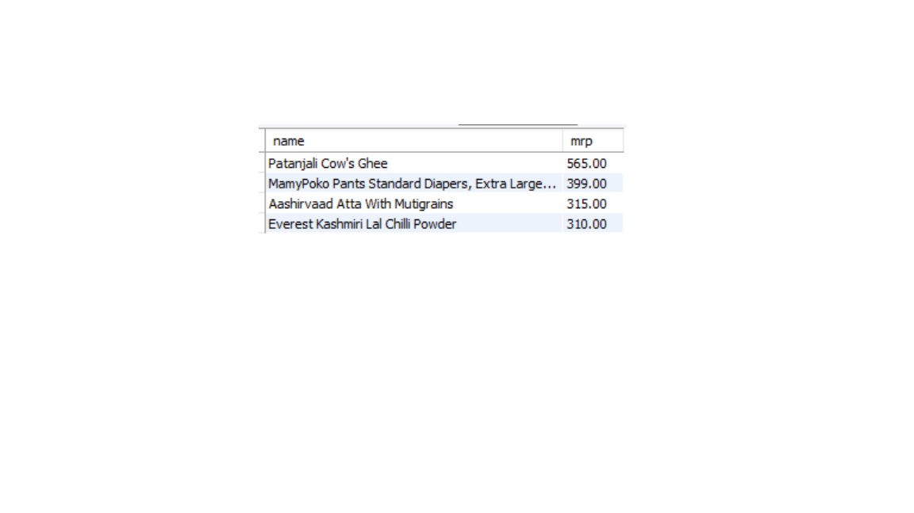

# 🛒 **Zepto E-commerce SQL Analysis**

> *Analysis of Zepto’s product catalog using SQL to understand pricing, discounts, and inventory behavior.*

---

## 📑 **Table of Contents**
- Overview  
- Problem Statement  
- Dataset  
- Tools and Technologies  
- Methods  
- Business Insights  
- How to Run This Project  
- Results and Conclusion  
- Data Limitations & Assumptions  
- Future Work  
- Author and Contact  

---

## 📌 **Overview**
This project uses **MySQL** to analyze Zepto’s product inventory and extract business-relevant insights about **pricing, discounts, stock availability, and category performance**.

It simulates how a data analyst evaluates an e-commerce catalog to support pricing and inventory decisions.

---

## 🎯 **Problem Statement**
Quick-commerce companies like Zepto need to know:
- Which products give customers the best value  
- Which categories drive most revenue  
- Which important products are out of stock  

This project answers these questions using SQL.

---

## 📊 **Dataset**
The dataset contains Zepto’s product catalog from Kaggle.  
Each row represents a product SKU with:
- Category  
- MRP  
- Discount  
- Weight  
- Stock availability  

A `sku_id` column was added before loading the data into MySQL.

---

## 🛠 **Tools and Technologies**
- MySQL  
- Excel (for SKU creation)  
- CSV  
- GitHub  

---

## 🔍 **Methods**
1. Imported the dataset into MySQL.  
2. Cleaned prices and converted values to rupees.  
3. Explored categories, stock levels, and pricing.  
4. Wrote SQL queries to analyze discounts, revenue, value-for-money, and inventory distribution.

---

## 📊 **Business Insights**
### 1. High-MRP products that are out of stock  

Items like **ghee, diapers, atta, and spices** are unavailable despite high prices, meaning **lost revenue on high-margin essentials**.

---

## ▶ **How to Run This Project**
1. Clone this repository:
   ```bash
   git clone https://github.com/hussainiadnan185-ux/zepto-sql-analysis.git
2. Run zepto.sql in MySQL to create the table.
3. Import zepto.csv into the table.
4. Execute the remaining queries in zepto.sql.
   
---

## 📌 **Results and Conclusion**
This project shows how Zepto uses discounts to drive volume, protects margins on premium products, and earns most of its revenue from packaged goods.

---

## ⚠ **Data Limitations & Assumptions**
1. Only catalog data is available, not real sales.
2. Revenue is estimated from price and stock.
3. Discounts are assumed to apply equally to all units.
4. Stock reflects only one point in time.

---

## 🚀 **Future Work**
1. Add real order and sales data.
2. Build a Power BI dashboard.
3. Perform supplier and margin analysis.

---

## **Author and Contact**

**Syed Murtuza Hussaini**
Aspiring Data Analyst
Email: hussainiadnan185@gmail.com

GitHub: https://github.com/hussainiadnan185-ux


